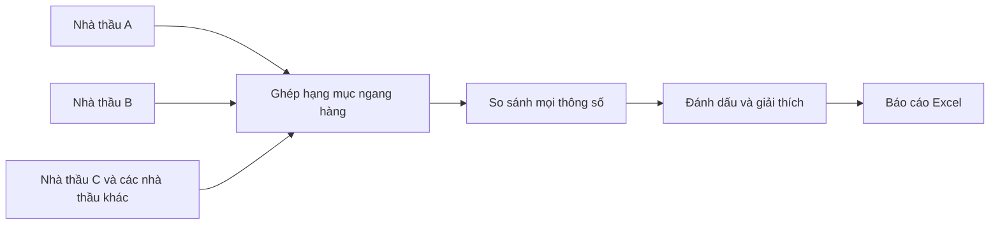

# Kiến trúc dễ hiểu – So sánh ngang hàng nhiều nhà thầu

## 1. Mục tiêu

Người dùng tải lên 2, 3 hoặc nhiều file chào giá. Hệ thống tìm những hạng mục tương ứng, đặt toàn bộ dữ liệu cạnh nhau, tính mức chênh lệch và xuất một file Excel tổng hợp.

Không có file chuẩn và không có nhà thầu chuẩn.



## 2. Luồng sử dụng

```text
Bước 1: Chọn các nhà thầu và file Excel
Bước 2: Chọn ngưỡng cảnh báo
Bước 3: Bấm so sánh
Bước 4: Xem tóm tắt
Bước 5: Tải báo cáo Excel
```

## 3. Các lớp chính

```text
Trình duyệt
   ↓ HTTP nội bộ
FastAPI
   ↓ tạo tác vụ nền
Excel Reader
   ↓
Peer Matcher
   ↓
Peer Comparison Engine
   ↓
Peer Report Builder
   ↓
File Excel tổng hợp
```

### Web UI

Dành cho người dùng không chuyên. Chỉ có một chế độ chính: so sánh ngang hàng nhiều HSDT.

### FastAPI

Nhận file, tạo mã tác vụ, trả tiến độ và cho tải báo cáo.

### Excel Reader

Đọc nhiều sheet, header nhiều tầng, ô gộp và dữ liệu số lớn mà không biến giá trị 0 thành ô trống.

### Peer Matcher

- So sánh mọi cặp nhà thầu.
- Ghép theo cả hai chiều.
- Ưu tiên cấu trúc, mã, STT và tên.
- Dùng fuzzy/model local cho các dòng khó.
- Hợp nhất thành nhóm, mỗi nhà thầu tối đa một dòng trong nhóm.

### Peer Comparison Engine

So sánh toàn bộ giá, khối lượng, tên, đơn vị, vật tư, thương hiệu, xuất xứ và thông số động.

### Peer Report Builder

Xuất báo cáo Excel dễ đọc, có phần trăm, lý do, ma trận và dữ liệu gốc của từng nhà thầu.

## 4. Cấu trúc thư mục

```text
HSMT_Enterprise_AI_v7_2_PeerComparison/
├── app.py                       # Web API và tác vụ nền
├── cli.py                       # Chạy bằng PowerShell
├── web/                         # Giao diện trình duyệt
├── core/
│   ├── excel_reader.py          # Đọc Excel lớn
│   ├── matcher.py               # Ghép hạng mục từng cặp
│   ├── peer_models.py           # Cấu trúc kết quả ngang hàng
│   ├── peer_comparison.py       # So sánh nhiều nhà thầu
│   ├── peer_reporter.py         # Xuất báo cáo Excel
│   ├── number_parser.py         # Đọc số Việt Nam/quốc tế
│   ├── text_normalizer.py       # Chuẩn hóa tên, mã và đơn vị
│   └── pipeline.py              # Điều phối toàn bộ quy trình
├── ocr/                         # OCR scan PDF chạy cục bộ
├── security/                    # Chặn mạng và cấu hình offline
├── models/                      # Model nội bộ, không đưa vào ZIP
└── tests/                       # Kiểm thử
```

## 5. Tại sao không lấy file đầu tiên làm chuẩn?

Nếu lấy file A làm chuẩn, kết quả có thể thay đổi khi người dùng đổi A và B. Bản này tránh vấn đề đó bằng cách:

```text
A ↔ B
A ↔ C
B ↔ C
...
```

Sau đó mới hợp nhất thành nhóm hạng mục chung.

## 6. Công thức nhiều nhà thầu

```text
Độ chênh (%) = (max - min) / mean(abs(values))
```

Mẫu số sử dụng toàn bộ nhà thầu, không dùng riêng một bên.

## 7. Bảo mật

```text
Trình duyệt nội bộ
      ↓
Ứng dụng trên máy/server công ty
      ↓
Model local + thư mục job tạm

Internet: bị chặn khi strict privacy được bật
```

Không cần Docker Compose trong giai đoạn hiện tại.
