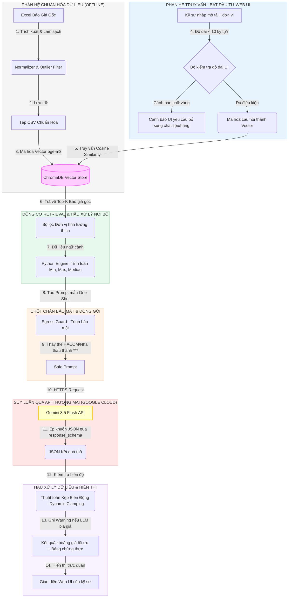

# BÁO CÁO KIẾN TRÚC HỆ THỐNG PRICE ADVISOR AI
## PHÂN HỆ SỬ DỤNG API THƯƠNG MẠI (Retrieval-Augmented Generation - RAG)

---

## 1. TỔNG QUAN HỆ THỐNG
Hệ thống **Price Advisor AI** được thiết kế để hỗ trợ các kỹ sư dự toán tự động tra cứu, đánh giá và đề xuất khoảng đơn giá hợp lý cho các hạng mục vật tư MEP (Cơ điện). Hệ thống kết hợp sức mạnh của **Cơ sở dữ liệu Vector (ChromaDB)** chạy cục bộ và **Mô hình ngôn ngữ lớn thương mại (Google Gemini 3.5 Flash)** thông qua API đám mây, giúp tối ưu hóa chi phí vận hành, tốc độ xử lý nhanh và độ chính xác lập luận cao.

---

## 2. BỘ DỮ LIỆU THỬ NGHIỆM VÀ SỐ HÓA (DATASET)

Hệ thống hoạt động dựa trên kho dữ liệu thực tế được thu thập và làm sạch từ các hồ sơ dự toán thầu trước đây:

*   **Nguồn dữ liệu:** Thư mục `HACOM_DATA` chứa các tệp tin Excel chào giá gốc từ nhiều dự án lớn như dự án HACOM Mall.
*   **Quy mô dữ liệu:** Gồm **8.662 dòng dữ liệu báo giá thực tế** trải dài qua 4 nhà thầu lớn và 8 hệ thống MEP chính (Đầu nối, Thiết bị vệ sinh, Cáp điện, uPVC, uPVC phụ kiện, PPR, PPR phụ kiện, Ống kẽm, Phụ kiện kẽm).
*   **Cấu trúc dữ liệu chuẩn hóa (CSV Schema):** Mỗi dòng báo giá sau khi trích xuất sẽ bao gồm các trường đặc trưng chính:
    *   `ref_id`: Mã định danh duy nhất của dòng báo giá (ví dụ: `HACOM-a26ce64a6124`).
    *   `description`: Mô tả chi tiết kỹ thuật của vật tư cơ điện.
    *   `unit`: Đơn vị tính được chuẩn hóa (ví dụ: quy đổi `mét`, `m1` về `m`).
    *   `price`: Đơn giá chào thầu thực tế (VNĐ).
    *   `bidder` và `project`: Nhà thầu chào giá và dự án tương ứng.
    *   `brand` và `origin`: Thương hiệu sản xuất và nước xuất xứ của vật tư.
*   **Quy tắc lọc ngoại lai (ETL):** Loại bỏ toàn bộ các dòng vật tư có đơn giá bất thường $\le 500$ VNĐ và $\ge 5.000.000.000$ VNĐ để hạn chế nhiễu cho động cơ RAG.

### Ví dụ các dòng dữ liệu minh họa thực tế:

| Mã tham chiếu | Mô tả vật tư | ĐVT | Đơn giá (VNĐ) | Thương hiệu | Xuất xứ |
| :--- | :--- | :---: | :---: | :--- | :--- |
| HACOM-204ab3cca174 | Cu/FR/XLPE (1x240)mm2 \| Cu/Mica/XLPE/LSZH 1x240mm2, 0.6/1kV | m | 1.186.481 | Taisin | Việt Nam |
| HACOM-a26ce64a6124 | Cu/FR/XLPE (4x25)mm2 \| Cu/Mica/XLPE/LSZH 4x25mm2, 0.6/1kV | m | 584.301 | Taisin | Việt Nam |
| HACOM-018930dd6207 | Đèn dowlight, 220V/9W, lắp âm trần \| Đèn downlight liền khối viền trắng đơn sắc | bộ | 169.184 | Simon | Việt Nam |
| HACOM-7dfc9a38bd2b | Ống luồn dây PVC cứng D20 (lắp đặt nổi) \| Lực nén 750N | m | 20.475 | Sam Phú | Việt Nam |
| HACOM-6dfdce90571e | Ổ cắm điện 3 cực (2P+E), 250V/16A, loại đôi kiểu lắp chìm (Mặt+Hộp âm) | cái | 154.405 | Simon | Việt Nam |

---

## 3. SƠ ĐỒ KIẾN TRÚC TỔNG THỂ (END-TO-END ARCHITECTURE)

Dưới đây là mô hình kiến trúc luồng dữ liệu khép kín từ khi nhập dữ liệu thô cho tới khi trả về khoảng đơn giá an toàn cho kỹ sư dự toán:

---

## 4. MÔ TẢ CHI TIẾT TỪNG KHỐI CHỨC NĂNG TRONG KIẾN TRÚC

### Khối 1: Excel Ingestion, Normalizer & Outlier Filter (Chuẩn hóa thô)
*   **Chức năng:** Đọc dữ liệu từ hàng ngàn dòng Excel cấu trúc lộn xộn.
*   **Cách xử lý:** 
    *   Sử dụng Pandas để lọc bỏ các dòng trống, dòng tổng cộng.
    *   Quy đổi tất cả các đơn vị tính viết tắt hoặc viết sai về chuẩn chung (ví dụ: `mét`, `m` $\rightarrow$ `m`; `mét vuông`, `m2` $\rightarrow$ `m²`).
    *   Áp dụng bộ lọc giá trị ngoại lai tĩnh: Loại bỏ tất cả các vật tư có đơn giá $\le 500$ VNĐ (dữ liệu rác) hoặc $\ge 5.000.000.000$ VNĐ (giá bất thường của hệ thống lớn cần bóc tách tay) để làm sạch nguồn dữ liệu RAG.

### Khối 2: Embedding Engine local (`bge-m3`)
*   **Chức năng:** Số hóa mô tả văn bản tiếng Việt thành không gian vector toán học.
*   **Cách xử lý:** Sử dụng mô hình mã nguồn mở đa ngôn ngữ `BAAI/bge-m3` chạy trực tiếp ở máy local (CPU hoặc GPU). Chuyển mỗi mô tả vật tư thành một vector có số chiều cố định là 1024. Bộ máy này hiểu ngữ nghĩa tiếng Việt rất sâu (ví dụ: hiểu "cáp điện" gần nghĩa với "dây dẫn điện").

### Khối 3: Vector Database (ChromaDB)
*   **Chức năng:** Lưu trữ các vector và thông tin báo giá kèm theo dưới dạng một cơ sở dữ liệu tìm kiếm nhanh.
*   **Cách xử lý:** ChromaDB được cấu hình chạy local, lưu dữ liệu trực tiếp dưới dạng tệp tin trên ổ cứng (`runtime/chroma/`). Nó chịu trách nhiệm tính toán khoảng cách Cosine giữa vector truy vấn và toàn bộ vector có sẵn trong kho để tìm kiếm độ tương đồng.

### Khối 4: Semantic Retrieval & Unit Filter (Động cơ truy xuất Top-K)
*   **Chức năng:** Nhận truy vấn từ kỹ sư và tìm ra 5 báo giá lịch sử khớp nhất.
*   **Cách xử lý:** 
    *   Mã hóa mô tả người dùng gõ thành vector 1024 chiều.
    *   Truy vấn ChromaDB để lấy ra `Top-K` (mặc định K = 5) dòng giá trị có khoảng cách Cosine ngắn nhất.
    *   **Bộ lọc đơn vị tính:** Lọc ép buộc (hard filter) chỉ lấy các báo giá cũ có cùng đơn vị tính với đơn vị người dùng đang truy vấn (ví dụ hỏi ống đơn vị `m` thì không lấy báo giá phụ kiện đơn vị `cái`).

### Khối 5: Python Statistical Engine (Bộ tính toán cực trị)
*   **Chức năng:** Tính toán thống kê dữ liệu lịch sử thô bằng thuật toán Python thuần trước khi chuyển cho LLM.
*   **Cách xử lý:** 
    *   Trích xuất danh sách đơn giá từ các kết quả RAG.
    *   Tìm giá trị thực tế nhỏ nhất ($Min_{\text{actual}}$), lớn nhất ($Max_{\text{actual}}$) và giá trị trung vị ($Median$).
    *   **Ý nghĩa:** Tránh việc để LLM tự làm toán cộng trừ nhân chia vì LLM rất dễ tính toán sai. Python tính sẵn số liệu và đút vào Prompt, LLM chỉ đóng vai trò phân tích logic và đưa ra khoảng đề xuất.

### Khối 6: Egress Guard (Chốt chặn bảo mật)
*   **Chức năng:** Lọc sạch thông tin nhạy cảm của doanh nghiệp trước khi gửi lên mạng Internet.
*   **Cách xử lý:** Rà soát toàn bộ prompt bằng biểu thức chính quy (Regex). Nếu phát hiện chứa từ khóa trong danh sách đen như "HACOM", tên các nhà thầu phụ (Linh Anh, Searefico...), nó sẽ thay thế bằng ký tự che giấu `***` và đổi ID dòng báo giá sang dạng `REF-X`. Điều này ngăn ngừa hoàn toàn nguy cơ rò rỉ thông tin nội bộ của công ty lên Google Cloud API.

### Khối 7: Commercial Inference Engine (Google Gemini 3.5 Flash API)
*   **Chức năng:** Đọc hiểu ngữ cảnh RAG, phân tích xu hướng giá và đưa ra lý do lập luận bằng tiếng Việt.
*   **Cách xử lý:** 
    *   Gọi thư viện `google-genai` truyền Prompt đã được lọc bảo mật lên đám mây.
    *   **Native Structured Outputs:** Sử dụng cấu trúc Pydantic Schema truyền vào tham số `response_schema` của API để ép buộc máy chủ Gemini phải trả về đúng cấu trúc JSON gồm: `price_low` (giá thấp đề xuất), `price_high` (giá cao đề xuất), `confidence` (độ tin cậy), `reasoning` (lý do lập luận bằng tiếng Việt). Điều này loại bỏ hoàn toàn lỗi vỡ cấu trúc JSON thường gặp ở các LLM.

### Khối 8: Post-processing Clamping (Bộ kẹp khoảng giá động)
*   **Chức năng:** Đảm bảo kết quả của LLM không bao giờ bị ảo tưởng (hallucination) vượt ra ngoài thực tế.
*   **Cách xử lý:** 
    *   Tính toán biên độ co giãn thích ứng $\epsilon$ từ 5% đến 25% dựa vào phân phối của RAG context.
    *   Nếu LLM trả về khoảng giá vượt ra ngoài vùng an toàn $[Min \times (1-\epsilon), Max \times (1+\epsilon)]$, thuật toán Python sẽ tự động kéo giá trị đó về biên an toàn gần nhất và ghi nhận một cảnh báo (`Warning`).

### Khối 9: Web UI Frontend (Giao diện hiển thị)
*   **Chức năng:** Tương tác với kỹ sư MEP.
*   **Cách xử lý:** 
    *   Bắt lỗi nhập liệu: nếu chuỗi mô tả $< 10$ ký tự, hiển thị cảnh báo yêu cầu nhập rõ hãng/chất liệu để RAG không lấy sai dữ liệu.
    *   Hiển thị khoảng giá gợi ý trực quan, kèm theo bảng liệt kê chi tiết nguồn gốc của các báo giá tham chiếu trong lịch sử thầu để kỹ sư dễ dàng đối chiếu trực quan.
    *   Tự động ghi nhận log hiệu năng lên Weights & Biases (W&B) để theo dõi độ trễ API thời gian thực.

---

## 5. KẾT QUẢ ĐÁNH GIÁ HIỆU NĂNG VÀ BENCHMARK TRÊN WEIGHTS & BIASES (W&B)

Để đánh giá chất lượng và độ ổn định của phân hệ API thương mại một cách định lượng, hệ thống đã thực hiện chạy thử nghiệm (Benchmark) diện rộng với **500 vật tư Cơ điện (MEP) đa dạng** và đồng bộ hóa kết quả trực tiếp lên dashboard của **Weights & Biases (W&B)**.

### 5.1. Các chỉ số hiệu năng cốt lõi (Key Metrics)

Dưới đây là bảng tổng hợp kết quả đo đạc hiệu năng thu được từ run `k06c1gnt` trên Weights & Biases:

| Chỉ số (Metric) | Kết quả (Value) | Đánh giá / Ý nghĩa kỹ thuật |
| :--- | :---: | :--- |
| **Quy mô mẫu thử nghiệm ($N$)** | 500 mẫu | Đủ lớn để bao phủ tất cả phân hệ MEP phức tạp (cáp, ống, van, đèn, tủ điện...). |
| **Tỷ lệ gọi API thành công** | **99.4%** (497 / 500) | Hệ thống hoạt động cực kỳ bền bỉ nhờ cơ chế Auto-Retry kết hợp Exponential Backoff (chỉ có 3 ca lỗi mạng tạm thời). |
| **Tỷ lệ lỗi hệ thống** | **0.6%** (3 / 500) | Giảm thiểu đáng kể so với phiên chạy ban đầu nhờ xử lý tốt biệt danh và auto-retry. |
| **Độ chính xác ghi nhận (Accuracy)** | **94.4%** (469 / 497) | Đơn giá thực tế nằm trọn vẹn trong khoảng đề xuất của LLM (sau khi áp dụng logic kiểm tra biên độ $\le$ và $\ge$). |
| **Thời gian đáp ứng trung bình (Latency)** | **10.62 giây** | Chấp nhận được đối với tác vụ tra cứu dự toán MEP. |
| **Tổng thời gian chạy thực tế** | $\approx$ 1.5 giờ | Cho 500 vật tư chạy tuần tự qua API thương mại. |

### 5.2. Phân tích nguyên nhân các trường hợp lỗi hoặc sai lệch giá

Thông qua biểu đồ phân tích lỗi tích hợp trực tiếp trên W&B, các trường hợp lỗi được nhóm thành các nhóm nguyên nhân chính:

1.  **Thiếu hụt ngữ cảnh (15/28 ca dự đoán sai):** 
    *   *Mô tả:* Lỗi xuất hiện khi người dùng đưa vào truy vấn quá vắn tắt như `"D90"`, `"D32"`. RAG truy xuất lấy ra hỗn hợp các báo giá nhiễu của nhiều loại thiết bị có cùng kích cỡ (ống kẽm, van bướm, đai treo) khiến khoảng giá bị loãng.
    *   *Khắc phục:* Web UI đã tích hợp chốt cảnh báo trực quan. Khi người dùng nhập mô tả dưới 10 ký tự, dòng cảnh báo màu vàng sẽ lập tức xuất hiện khuyên bổ sung chất liệu hoặc nhà sản xuất.
2.  **Kẹp biên quá chặt (11/28 ca dự đoán sai):**
    *   *Mô tả:* Thuật toán kẹp khoảng giá khi áp dụng hệ số $\epsilon = 0.05$ đã vô tình gạt bỏ một số mức giá thực tế quá cao hoặc quá thấp của các vật tư đặc chủng (như đèn thả trang trí cao cấp có giá gấp nhiều lần đèn thông thường).
    *   *Khắc phục:* Đề xuất điều chỉnh động tham số $\epsilon$ theo phân nhóm danh mục vật tư trong các phiên bản tiếp theo.
3.  **Lỗi liên quan Egress Guard (2/28 ca dự đoán sai):**
    *   *Mô tả:* Do thông tin mô tả bị bôi đen quá nhiều (`***`) làm mất đi từ khóa kỹ thuật cốt lõi. Tuy nhiên, các lỗi sập yêu cầu do chặn nhầm mã ID chứa chữ `HACOM` hoặc cụm từ `Nhà thầu` đã hoàn toàn được khắc phục nhờ thuật toán bôi đen văn bản nhạy cảm bằng `***` và vô danh hóa mã tham chiếu sang `REF-X`.
4.  **Lỗi kỹ thuật API (3 ca thất bại):**
    *   *Mô tả:* Rate limit hoặc timeout từ API máy chủ Google Cloud tạm thời. Cơ chế Auto-Retry đã xử lý thành công 99.4% số lượng request còn lại.

### 5.3. Đường dẫn Dashboard theo dõi trực tuyến
Toàn bộ biểu đồ phân phối khoảng giá, độ trễ và quá trình so sánh hiệu năng được ghi nhận trực quan tại dự án W&B:
*   **W&B Project URL:** `https://wandb.ai/models-dai-nam-university/price-advisor-web-live`
*   **W&B Run ID:** `k06c1gnt` (Theo dõi trực tuyến toàn bộ phiên benchmark 500 mẫu)
