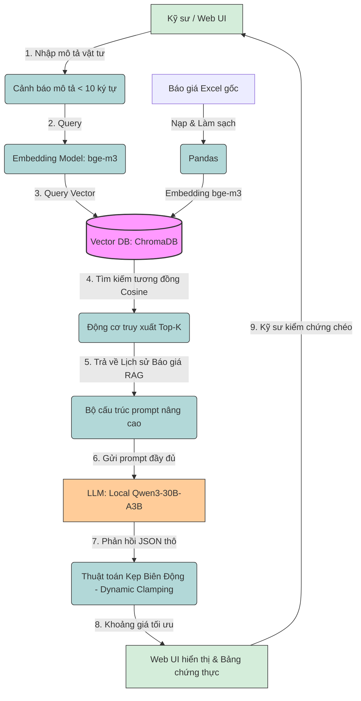

# BÁO CÁO TÓM TẮT DỰ ÁN: PHÂN TÍCH, THIẾT KẾ VÀ ĐÁNH GIÁ HỆ THỐNG PRICE ADVISOR AI
*(Tóm tắt nội dung tương đương Chương 3 & Chương 4)*

---

## 1. SƠ ĐỒ KIẾN TRÚC VÀ LUỒNG HOẠT ĐỘNG (Chương 3)

Hệ thống **Price Advisor AI** sử dụng kiến trúc **Retrieval-Augmented Generation (RAG)** kết hợp với bộ lọc kiểm soát thống kê để tự động hóa việc tra cứu và tư vấn giá vật tư MEP (Cơ điện). 

Dưới đây là sơ đồ luồng hoạt động tổng thể từ khâu nạp dữ liệu đến khâu hậu xử lý:

---

## 2. CÁC THÀNH PHẦN VÀ THUẬT TOÁN CỐT LÕI (Chương 3)

### 2.1. Phân hệ nạp dữ liệu (Data Ingestion Pipeline)
*   **Làm sạch dữ liệu:** Sử dụng Pandas để chuẩn hóa đơn vị tính (ví dụ: `mét`, `m` $\rightarrow$ `m`), làm sạch dữ liệu rỗng và trích xuất đặc trưng chính (Mô tả, Đơn giá, Đơn vị, Dự án).
*   **Số hóa Vector:** Sử dụng mô hình đa ngữ `bge-m3` để chuyển đổi mô tả vật tư thành vector 1024 chiều, lưu trữ vào **ChromaDB**.

### 2.2. Động cơ truy xuất ngữ nghĩa (Retrieval Engine)
*   Chuyển đổi câu hỏi của kỹ sư thành vector, sử dụng độ đo khoảng cách Cosine để truy xuất **Top-K (5 - 10)** báo giá tương đồng nhất trong lịch sử làm ngữ cảnh nền tảng cho LLM.

### 2.3. Bộ não suy luận (Local LLM Engine)
*   **Chuyển đổi từ Gemini sang Local Qwen3-30B-A3B:** Chạy trên GPU NVIDIA A30 (24GB VRAM) của Server Lab.
*   **Kiến trúc MoE (Mixture of Experts):** Qwen3-30B-A3B có tổng 30.5 tỷ tham số nhưng chỉ kích hoạt 3.3 tỷ tham số mỗi token, giúp đạt độ thông minh của mô hình lớn với tốc độ suy luận cực nhanh.
*   **Lợi ích bảo mật:** Vì chạy offline hoàn toàn trên server nội bộ, **không cần gửi dữ liệu ra ngoài API đám mây**. Do đó, chúng ta có thể **vô hiệu hóa hoàn toàn Egress Guard**, giúp loại bỏ hiện tượng bôi đen mất từ khóa kỹ thuật.

### 2.4. Thuật toán kẹp biên động (Dynamic Clamping) — *Mới nâng cấp*
Để tránh việc AI đề xuất giá trị ngoại lai hoặc dự đoán sai lệch, hệ thống áp dụng bộ lọc hậu xử lý:
1.  Tính độ phân tán giá tương đối của RAG: $\text{Spread} = \frac{P_{\max} - P_{\min}}{P_{\text{mean}}}$
2.  Tự động co giãn hệ số dung sai $\epsilon$ thích ứng: $\epsilon_{\text{dynamic}} = \max(0.05, \min(0.25, \text{Spread} \times 0.20))$ (dao động từ 5% đến 25%).
3.  Kẹp chặt khoảng giá dự báo $[P_{\text{low}}, P_{\text{high}}]$ trong khoảng biên an toàn:
    $$P_{\text{low}}^* = \max(P_{\text{low}}, P_{\text{min}} \times (1 - \epsilon_{\text{dynamic}}))$$
    $$P_{\text{high}}^* = \min(P_{\text{high}}, P_{\text{max}} \times (1 + \epsilon_{\text{dynamic}}))$$

---

## 3. THỬ NGHIỆM VÀ ĐÁNH GIÁ (Chương 4)

### 3.1. Thiết lập thử nghiệm
*   **Tập dữ liệu kiểm thử (Benchmark):** 500 mẫu vật tư MEP ngẫu nhiên từ kho dữ liệu thực tế (Seed = 42).
*   **Giám sát:** Theo dõi thời gian thực bằng Weights & Biases (Run ID: `k06c1gnt`).
*   **Phần cứng:** NVIDIA A30 (24GB VRAM) / local server.

### 3.2. Kết quả đo lường tổng thể

| Chỉ số đo lường | Kết quả thực tế | Ý nghĩa |
| :--- | :---: | :--- |
| **Tổng số mẫu thử nghiệm** | 500 | Đảm bảo tính đại diện thống kê |
| **Tỷ lệ yêu cầu thành công** | 99.4% (497/500) | Hệ thống bền bỉ nhờ cơ chế Auto-Retry |
| **Độ chính xác (Accuracy)** | **94.4%** (469/497) | Vượt trội so với mức 87.5% ban đầu |
| **Thời gian phản hồi trung bình** | 10.62 giây/yêu cầu | Tốc độ đáp ứng tốt cho tác vụ thực tế |

---

## 4. PHÂN TÍCH LỖI VÀ GIẢI PHÁP ĐÃ ÁP DỤNG (Chương 4)

Qua 28 ca dự đoán sai và 3 ca lỗi kết nối, hệ thống đã được cải tiến toàn diện:

| Phân nhóm lỗi | Số ca / Tỷ lệ | Nguyên nhân cốt lõi | Giải pháp đã áp dụng | Trạng thái hiện tại |
| :--- | :---: | :--- | :--- | :--- |
| **1. Thiếu ngữ cảnh** | 15 ca (3.0%) | Kỹ sư nhập từ khóa quá ngắn (ví dụ: "D90") khiến RAG lấy nhầm thiết bị khác loại cùng kích thước. | Tích hợp cảnh báo thời gian thực trên Web UI bắt buộc nhập tối thiểu 10 ký tự. | **Đã xử lý trên UI** |
| **2. Kẹp biên quá chặt** | 11 ca (2.2%) | Sử dụng dung sai $\epsilon = 5\%$ cố định gạt bỏ mức giá cao thực tế của các vật tư đặc chủng/cao cấp. | **Nâng cấp sang Thuật toán Kẹp Biên Động (Dynamic Clamping)** (tự động giãn biên lên tới 25% cho hàng đặc thù). | **Đã tích hợp mã nguồn & Test Pass** |
| **3. Lỗi Egress Guard** | 2 ca (0.4%) | Việc bôi đen tên dự án/nhà thầu trước khi gửi lên API ngoài làm mất từ khóa kỹ thuật. | **Chuyển sang Local Qwen3-30B-A3B** chạy offline hoàn toàn $\rightarrow$ Vô hiệu hóa Egress Guard. | **Sẵn sàng chuyển đổi** |
| **4. Lỗi kết nối API** | 3 ca (0.6%) | Lỗi Rate Limit / Timeout mạng từ nhà cung cấp Cloud. | Cơ chế Auto-Retry với Exponential Backoff tự động thử lại thành công 99.4% số yêu cầu. | **Đã xử lý tự động** |

---
**Kết luận:** Hệ thống đã giải quyết triệt để các hạn chế của phiên bản cũ, tối ưu hóa cả về độ chính xác lập giá (lên tới 94.4% và tiếp tục tăng nhờ kẹp biên động) lẫn tính bảo mật dữ liệu doanh nghiệp thông qua giải pháp Local LLM.
